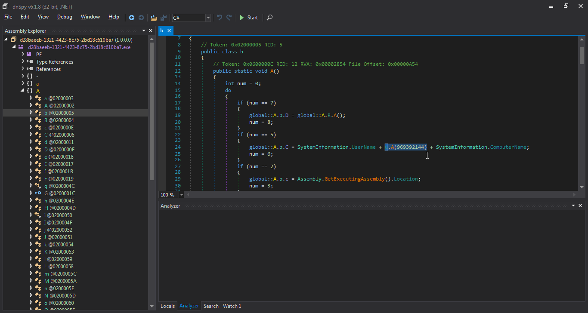
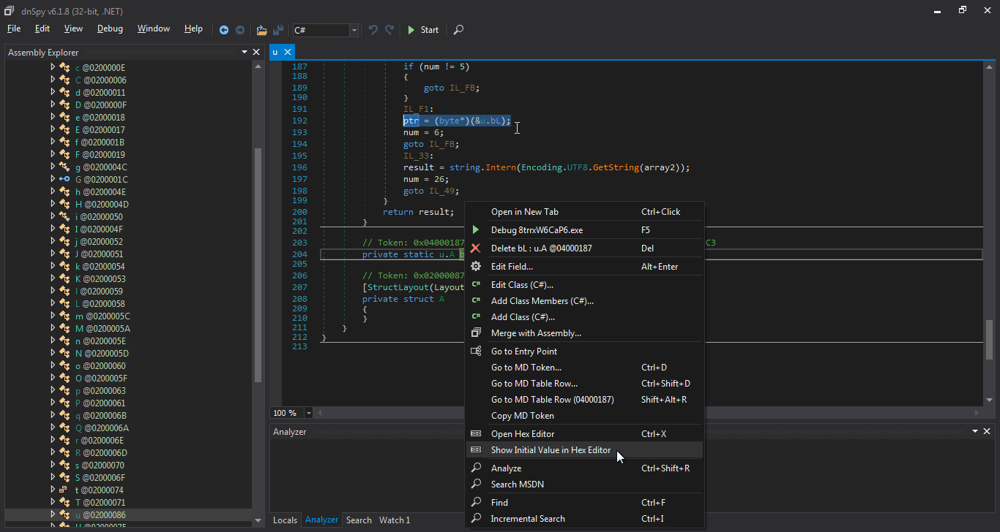

# Agent Tesla Strings Decoder

Copyright (c) 2023, Tangent65536;  
All rights reserved.  

---

A primitive tool that decodes the obfuscated strings in the latest (as of Mar 13, 2023) AgentTesla samples. The original IL instructions may be found [here](misc/opcodes.txt).  
(Yes, I reconstructed the function by manually combing through the IL instructions.)  

## Usage
`node decodeAgentTesla.js <bin-path>`  
The target file should be the "initial value" (as a byte array in C#) of the static field that holds the blob of obfuscated strings.

### **Step-by-step guide**
(**Note**: Usually you will get packed samples instead of the raw file shown in the following images. You'll have to unpack them first. I might publish the static analysis report of the packer later when I have time to spare.)  

Identify the function that retrieves strings by following the entry point in a decompiler. The function call(s) you're going after may look like the highlighted part below.  

In the latest samples I've received, the target function is always `String A::u.A(int)`.  

Within the function, find the static field referenced in its procedure. Extract the initial value of it. You may access the hex-encoded value in [`dnSpy`](https://github.com/dnSpyEx/dnSpy) by right-clicking the field.  

Now convert the hex string into a binary file, and pass its file path into the command as `<bin-path>`. The decoded strings will be dumped to `strings.json` in your working directory.  

### **Demo samples (unpacked)**
[`1059396a61125e9ce6a8fb24fa6412fa3cae4b48`](https://www.virustotal.com/gui/file/d1cc2810241b679da6d026e67fc610f36e69b08c28c7d0472d523167e1cf09f5) / [Strings](demo/strings-1059396a61125e9ce6a8fb24fa6412fa3cae4b48.json)  
[`8f2f1119740b83001cd029d3c5e46ebc8e77e176`](https://www.virustotal.com/gui/file/cd1a80e5e9e7b9bdbf59de12a4bd5fa0b43da512ed4129a92ec2b626cd8a3375) / [Strings](demo/strings-8f2f1119740b83001cd029d3c5e46ebc8e77e176.json)  
